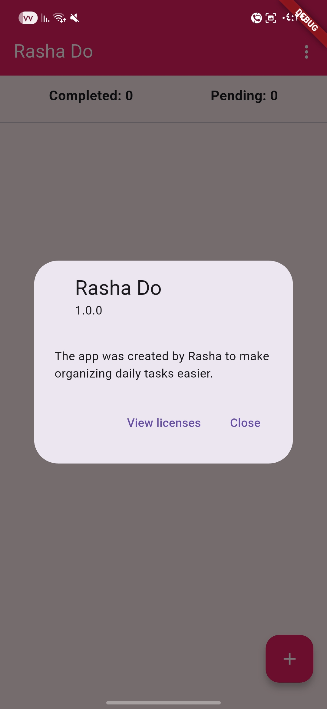
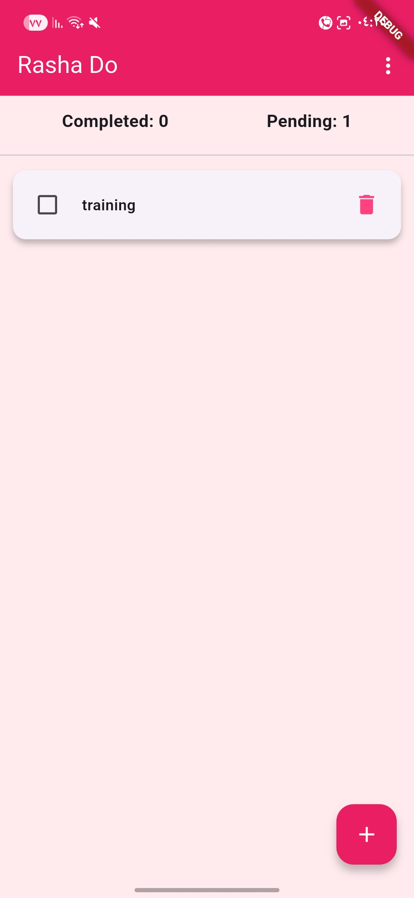
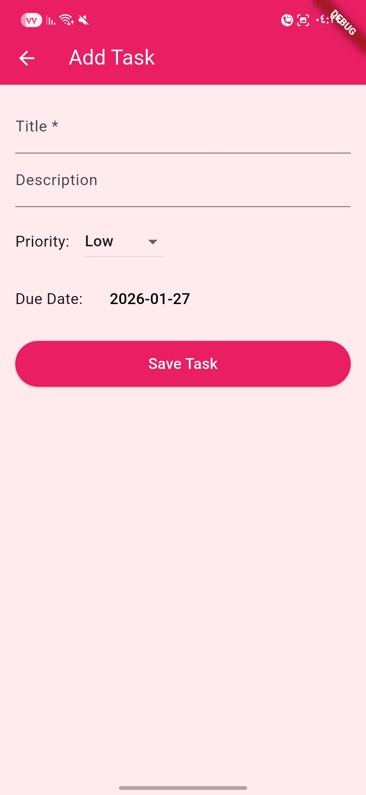
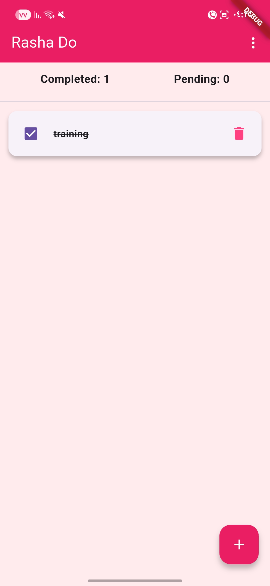

# Rasha_Do

Rasha_Do is a simple task manager app built with Flutter.

## Features
- Add, edit, delete tasks
- Set task priority (Low, Medium, High)
- Set due date for tasks
- Show completed and pending tasks

## How to Run
1. Clone the project
2. Run `flutter pub get`
3. Run `flutter run`

## Project Structure
- lib/models/
- lib/services/
- lib/screens/
- lib/widgets/
- lib/utils/

## Contributors
- Rasha Momani

## License
MIT License © 2026
## Screenshots

